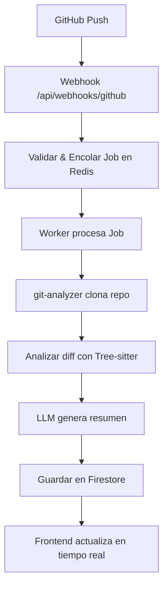

# KONTEXTO IA

Sistema inteligente de análisis y documentación de código con IA. Una plataforma que automatiza la generación de contexto y documentación técnica para repositorios de software.

## 📋 Índice de Proyectos

- [🚀 Inicio Rápido](#-inicio-rápido-con-docker)
- [🎨 Proyecto Frontend (Web App)](#-proyecto-frontend-web-app)
- [⚙️ Proyecto Backend (API Services)](#️-proyecto-backend-api-services)
- [🔄 Proyecto Worker (Background Processing)](#-proyecto-worker-background-processing)
- [📦 Proyecto Packages (Shared Libraries)](#-proyecto-packages-shared-libraries)
- [🐳 Proyecto Infrastructure (Docker & DevOps)](#-proyecto-infrastructure-docker--devops)

## 🚀 Inicio Rápido con Docker

### Prerrequisitos

- [Docker](https://www.docker.com/get-started)
- [Docker Compose](https://docs.docker.com/compose/install/)
- Git

### Instalación y Ejecución

1. **Clona el repositorio:**
```bash
git clone <tu-repo-url>
cd RulAItem
```

2. **Ejecuta con Docker Compose:**
```bash
# Construir e iniciar todos los servicios
docker-compose up --build

# O en segundo plano
docker-compose up -d --build
```

3. **Accede a la aplicación:**
- Frontend: http://localhost:3000
- API: http://localhost:3001
- Firebase Emulator UI: http://localhost:4000
- Pinecone (si se configura): Puerto 6333

## 📋 Variables de Entorno

Crea un archivo `.env` en la raíz del proyecto:

```env
# Autenticación
NEXTAUTH_SECRET=tu_secret_key_aqui
NEXTAUTH_URL=http://localhost:3000

# GitHub OAuth
GITHUB_ID=tu_github_client_id
GITHUB_SECRET=tu_github_client_secret

# Firestore
GOOGLE_APPLICATION_CREDENTIALS=/app/firebase-credentials.json
FIREBASE_PROJECT_ID=tu_project_id

# Pinecone (Opcional)
PINECONE_API_KEY=tu_pinecone_api_key
PINECONE_ENVIRONMENT=tu_environment

# OpenAI / LLM
OPENAI_API_KEY=tu_openai_api_key

# Worker Config
REDIS_URL=redis://redis:6379
NODE_ENV=development
```

## 🏗️ Arquitectura Técnica

### Stack Tecnológico

- **Frontend:** Next.js 14+ (App Router) + TypeScript
- **Backend:** Node.js + Express
- **Base de Datos:** Firestore (Google Cloud)
- **Base de Datos Vectorial:** Pinecone
- **Caché:** Redis
- **Contenedores:** Docker + Docker Compose
- **Monorepo:** Turborepo
- **Autenticación:** Auth.js (NextAuth)
- **Análisis de Código:** Tree-sitter + Babel Parser

## 📁 Estructura del Proyecto

```
kontexto-ia/
├── apps/
│   └── web/                 # Aplicación Next.js (Frontend + API)
│       ├── app/            # App Router (Next.js 14+)
│       ├── components/     # Componentes React
│       ├── lib/           # Utilidades y hooks
│       └── store/         # Stores Zustand
├── packages/
│   ├── core/              # Lógica compartida y schemas Zod
│   ├── db/                # Abstracción de Firestore
│   ├── ui/                # Componentes UI compartidos
│   └── git-analyzer/      # Análisis de repositorios Git
├── services/
│   └── worker/            # Procesador de tareas en background
├── docker/
│   ├── web.Dockerfile     # Dockerfile para Next.js
│   ├── worker.Dockerfile  # Dockerfile para Worker
│   └── nginx.conf         # Configuración Nginx
├── docker-compose.yml     # Orquestación de contenedores
├── docker-compose.dev.yml # Desarrollo local
└── turbo.json            # Configuración Turborepo
```

## 🐳 Configuración Docker

### Archivos Docker Principales

#### `docker-compose.yml`
```yaml
version: '3.8'

services:
  # Next.js Frontend + API
  web:
    build:
      context: .
      dockerfile: docker/web.Dockerfile
    ports:
      - "3000:3000"
    environment:
      - NODE_ENV=production
      - NEXTAUTH_URL=http://localhost:3000
    env_file:
      - .env
    depends_on:
      - redis
      - firebase-emulator
    volumes:
      - ./firebase-credentials.json:/app/firebase-credentials.json:ro

  # Worker Service
  worker:
    build:
      context: .
      dockerfile: docker/worker.Dockerfile
    environment:
      - NODE_ENV=production
      - REDIS_URL=redis://redis:6379
    env_file:
      - .env
    depends_on:
      - redis
      - firebase-emulator
    volumes:
      - ./firebase-credentials.json:/app/firebase-credentials.json:ro
      - /tmp/git-repos:/tmp/git-repos

  # Redis Cache
  redis:
    image: redis:7-alpine
    ports:
      - "6379:6379"
    volumes:
      - redis_data:/data

  # Firebase Emulator Suite
  firebase-emulator:
    image: gcr.io/firebase-js-sdk/emulator
    ports:
      - "4000:4000"  # Emulator Suite UI
      - "8080:8080"  # Firestore
      - "9099:9099"  # Authentication
    volumes:
      - ./firebase.json:/firebase.json
      - ./firestore.rules:/firestore.rules
      - firebase_data:/data
    command: firebase emulators:start --host 0.0.0.0

  # Nginx Reverse Proxy
  nginx:
    image: nginx:alpine
    ports:
      - "80:80"
    volumes:
      - ./docker/nginx.conf:/etc/nginx/nginx.conf:ro
    depends_on:
      - web

volumes:
  redis_data:
  firebase_data:
```

#### `docker/web.Dockerfile`
```dockerfile
FROM node:18-alpine AS base

# Instalar dependencias del sistema
RUN apk add --no-cache libc6-compat git

WORKDIR /app

# Instalar Turborepo globalmente
RUN npm install -g turbo

# Copiar archivos de configuración
COPY package*.json turbo.json ./
COPY apps/web/package*.json ./apps/web/
COPY packages/*/package*.json ./packages/*/

# Instalar dependencias
RUN npm ci --only=production

# Etapa de construcción
FROM base AS builder
WORKDIR /app

# Instalar todas las dependencias (incluyendo dev)
RUN npm ci

# Copiar código fuente
COPY . .

# Construir la aplicación
RUN turbo build --filter=web

# Etapa de producción
FROM node:18-alpine AS runner
WORKDIR /app

RUN addgroup --system --gid 1001 nodejs
RUN adduser --system --uid 1001 nextjs

# Copiar archivos construidos
COPY --from=builder /app/apps/web/public ./public
COPY --from=builder --chown=nextjs:nodejs /app/apps/web/.next/standalone ./
COPY --from=builder --chown=nextjs:nodejs /app/apps/web/.next/static ./apps/web/.next/static

USER nextjs

EXPOSE 3000

ENV PORT 3000
ENV HOSTNAME "0.0.0.0"

CMD ["node", "apps/web/server.js"]
```

#### `docker/worker.Dockerfile`
```dockerfile
FROM node:18-alpine

# Instalar Git y herramientas del sistema
RUN apk add --no-cache git openssh-client

WORKDIR /app

# Copiar archivos de configuración
COPY package*.json turbo.json ./
COPY services/worker/package*.json ./services/worker/
COPY packages/*/package*.json ./packages/*/

# Instalar dependencias
RUN npm ci --only=production

# Copiar código fuente
COPY . .

# Construir paquetes compartidos
RUN npm run build --workspace=packages/core
RUN npm run build --workspace=packages/db
RUN npm run build --workspace=packages/git-analyzer

WORKDIR /app/services/worker

# Crear directorio temporal para repos
RUN mkdir -p /tmp/git-repos

EXPOSE 3001

CMD ["npm", "start"]
```

## 🚀 Servicios y Módulos Detallados

### apps/web (Frontend Next.js)
Aplicación principal con interfaz de usuario y API Routes.

**Tecnologías clave:**
- **Auth.js**: Autenticación GitHub OAuth
- **TanStack Table**: Tablas dinámicas con filtros
- **Chart.js**: Visualizaciones y gráficas
- **Framer Motion**: Animaciones y transiciones
- **Zustand**: Manejo de estado global
- **Day.js**: Manipulación de fechas

### packages/core (Lógica Compartida)
Esquemas Zod y tipos TypeScript compartidos entre todos los módulos.

```typescript
// Ejemplo: zod-schemas.ts
import { z } from 'zod';

export const ContextoSchema = z.object({
  id: z.string().cuid(),
  nombre: z.string().min(5),
  descripcion: z.string(),
  repoUrl: z.string().url("Debe ser una URL válida"),
  responsableId: z.string(),
  createdAt: z.date(),
});

export type TContexto = z.infer<typeof ContextoSchema>;
```

### packages/db (Abstracción Firestore)
Capa de acceso a datos unificada con validación Zod.

**Características:**
- Cliente Firestore singleton
- Repositories con CRUD completo
- Validación automática con schemas
- Soporte para Firebase Emulator

### services/worker (Procesador Background)
Servicio Node.js para tareas pesadas de análisis de código.

**Flujo de trabajo:**
1. Escucha cola de trabajos en Redis/Firestore
2. Clona y analiza repositorios Git
3. Utiliza Tree-sitter para parsing AST
4. Genera documentación con LLM
5. Almacena resultados en Firestore

### packages/git-analyzer (Análisis Git)
Motor de análisis de repositorios con capacidades avanzadas.

**Funcionalidades:**
- Clonado seguro de repositorios
- Análisis de diffs y commits
- Extracción de estructura de código
- Detección de patrones y arquitectura

## ⚡ Flujo de Datos: Análisis de Commit



### Pasos Detallados

1. **🔔 Trigger**: Push en GitHub dispara webhook
2. **📥 Recepción**: API Route `/api/webhooks/github` procesa evento
3. **⏰ Encolado**: Job se añade a cola Redis con estado `pending`
4. **⚙️ Procesamiento**: Worker toma job y cambia estado a `processing`
5. **🔍 Análisis**: `git-analyzer` clona repo y analiza cambios
6. **🤖 IA**: LLM procesa diff y genera documentación
7. **💾 Persistencia**: Resultados se guardan en Firestore
8. **🔄 UI Sync**: Frontend se actualiza vía WebSocket/SSE

## 🛠️ Comandos de Desarrollo

### Desarrollo Local

```bash
# Instalar dependencias
npm install

# Desarrollo con hot-reload
npm run dev

# Construir para producción
npm run build

# Ejecutar tests
npm run test

# Lint y formato
npm run lint
npm run format
```

### Comandos Docker

```bash
# Construir imágenes
docker-compose build

# Ejecutar en desarrollo
docker-compose -f docker-compose.yml -f docker-compose.dev.yml up

# Ejecutar en producción
docker-compose up -d

# Ver logs
docker-compose logs -f [servicio]

# Limpiar contenedores
docker-compose down -v
```

## 📋 Checklist de Implementación

### ✅ Fase 1: Configuración Base
- [ ] Inicializar monorepo con Turborepo
- [ ] Configurar Docker y Docker Compose
- [ ] Estructura de carpetas completa
- [ ] Variables de entorno configuradas

### ✅ Fase 2: Core y Database
- [ ] Esquemas Zod en `packages/core`
- [ ] Cliente Firestore en `packages/db`
- [ ] Repositories con CRUD completo
- [ ] Firebase Emulator funcionando

### ✅ Fase 3: Autenticación y UI
- [ ] Auth.js con GitHub OAuth
- [ ] Middleware de protección de rutas
- [ ] Layout principal y páginas base
- [ ] Store Zustand para estado global

### ✅ Fase 4: Análisis de Código
- [ ] `git-analyzer` con Tree-sitter
- [ ] Worker service con Redis
- [ ] API webhooks GitHub
- [ ] Integración LLM (OpenAI)

### ✅ Fase 5: Features Avanzados
- [ ] TanStack Table para datos
- [ ] Chart.js para visualizaciones
- [ ] Framer Motion para animaciones
- [ ] Hotkeys.js para atajos

### ✅ Fase 6: Despliegue
- [ ] Configuración producción Docker
- [ ] CI/CD pipeline
- [ ] Monitoreo y logs
- [ ] Tests E2E completos

## 🔧 Herramientas de Desarrollo

### Requisitos del Sistema
- **Node.js**: 18+ LTS
- **Docker**: 20.10+
- **Git**: 2.30+
- **RAM**: 4GB mínimo, 8GB recomendado

### IDEs Recomendados
- **VS Code** con extensiones TypeScript/React
- **WebStorm** para proyectos JavaScript/TypeScript
- **Cursor** para desarrollo asistido por IA

## 📚 Documentación Adicional

- [🏗️ Arquitectura Detallada](./docs/architecture.md)
- [🔐 Guía de Seguridad](./docs/security.md)
- [🚀 Despliegue](./docs/deployment.md)
- [🧪 Testing](./docs/testing.md)
- [🎨 UI/UX Guidelines](./docs/ui-guidelines.md)

## 🤝 Contribuir

1. Fork el repositorio
2. Crear branch feature (`git checkout -b feature/nueva-caracteristica`)
3. Commit cambios (`git commit -am 'Añadir nueva característica'`)
4. Push branch (`git push origin feature/nueva-caracteristica`)
5. Crear Pull Request

## 📄 Licencia

Este proyecto está licenciado bajo MIT License - ver [LICENSE](LICENSE) para detalles.

---

**Desarrollado con ❤️ para automatizar la documentación de código con IA**